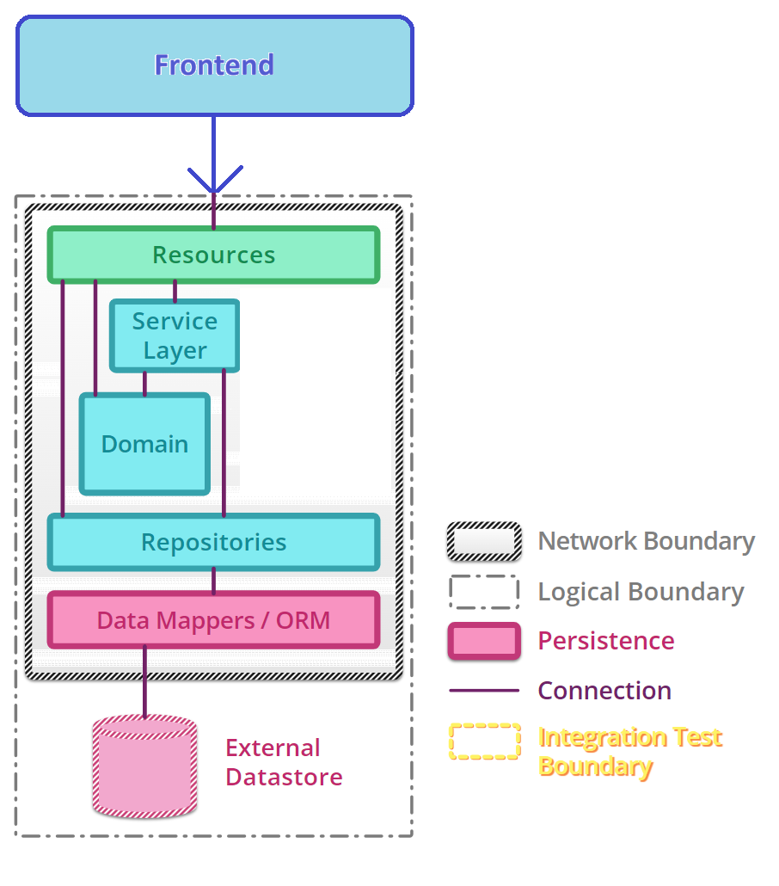

# Motivation

This repo is part of a Demo on Consumer-driven testing using Pact. 
It is a simple project that demonstrates how to use Pact to test the interactions between a consumer and a provider.

The project has been copied from the [Pact .NET Sample](https://github.com/pact-foundation/pact-net/tree/master/samples/OrdersApi)

# Some basics
* **Quality**\
**[The degree to which a component, system or process meets specified requirements and/or user/customer needs and expectations.](https://istqb-glossary.page/quality)**
* Quality Assurance\
[Part of quality management focused on providing confidence that quality requirements will be fulfilled.](https://istqb-glossary.page/quality-assurance)
* Quality Control\
[A set of activities designed to evaluate the quality of a component or system.](https://istqb-glossary.page/quality-control)
* Test Automation\
[The use of software to perform or support test activities, e.g., test management, test design, test execution and results checking.](https://istqb-glossary.page/test-automation)
* Testing Pyramid\

# The problem

## A simple system, with a single team working Fullstack
Let's say, we have a simple system with a frontend and a single backend service. The backend service does not use any external APIs, and it has only a db somewhere.

Here, applying the Testing Pyramid is quite comfy:
* The modules are isolated well, so we can test them separately with unit tests. E.g.: the Domain Layer. or with API mocking, the FE can also be tested separately.
* The integration tests can cover the interactions between the modules. E.g.: the Repository Layer and the Domain Layer.
  * We can also create higher tests, by using e.g.: in-memory db and run a few procedures with all the modules together, from top-to-bottom.\
  Note, this is a good place for the gherkin tests, however, these APIs could support many more scenarios than the UI.
* E2E, or UI tests can cover the whole system, including the UI.\
This is very close to the users, hence the reason we usually use use gherkin here. Implementing here the User Acceptance Tests are also a good fit, not to forget about BDD.\
We can also use a prepared/dedicated DB for these tests, so we can use a whole **S**ystem **U**nder **T**est.

## The system grows, and the team splits into Frontend and Backend teams
* They can still use their unit and integration tests within their areas.
* Since they work on the same features individually, in different platforms, they need to discuss the API contract.\
Some approaches are:
  * They plan-ahead and **discuss the details of the API** before they start the implementation in all the ares _(yes-yes, it has some caveats..)_
  * They use OpenAPI to **define the contracts** (tbd which methodology they apply)

## The system grows, and the Backend team splits into multiple teams, and the Product also gets split into multiple Services

- honnan tudom, hogy az én servicemnek minek kell megfelelnie
- hogyan tudom biztosítani, hogy a másik service is megfelelően működik
- hogyan tudom biztosítani, hogy a frontend is megfelelően működik

- consumer testing intro
- pact
- pact sharing pacts (s3?)

# A solution, Consumer-driven test
_You can usually find it with the name: Contract-testing._

## What is it?
Consumer-driven testing is a technique that allows you to test the interactions between a consumer and a provider.

# References
* [Microservice testing](https://martinfowler.com/articles/microservice-testing/)
* [CDC testing](https://microsoft.github.io/code-with-engineering-playbook/automated-testing/cdc-testing/)
* [Pact](https://docs.pact.io/)
* [Pact .NET](https://github.com/pact-foundation/pact-net/blob/master/README.md)
* [ISTQB Glossary](https://istqb-glossary.page/)