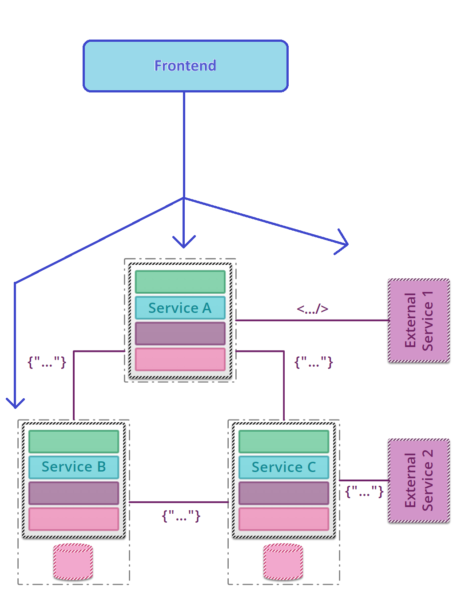

# Motivation

This repo is part of a Demo on Consumer-driven testing using Pact. 
It is a simple project that demonstrates how to use Pact to test the interactions between a consumer and a provider.

The project has been copied from the [Pact .NET Sample](https://github.com/pact-foundation/pact-net/tree/master/samples/OrdersApi)

# Some basics
* **Quality**\
**[The degree to which a component, system or process meets specified requirements and/or user/customer needs and expectations.](https://istqb-glossary.page/quality)**
* Quality Assurance\
[Part of quality management focused on providing confidence that quality requirements will be fulfilled.](https://istqb-glossary.page/quality-assurance)
* Quality Control\
[A set of activities designed to evaluate the quality of a component or system.](https://istqb-glossary.page/quality-control)
* Test Automation\
[The use of software to perform or support test activities, e.g., test management, test design, test execution and results checking.](https://istqb-glossary.page/test-automation)
* Testing Pyramid\


# Building up the context

## A simple system, with a single team working Fullstack
Let's say, we have a simple system with a frontend and a single backend service. The backend service does not use any external APIs, and it has only a db somewhere.


Here, applying the Testing Pyramid is quite comfy:
* The modules are isolated well, so we can test them separately with unit tests. E.g.: the Domain Layer. or with API mocking, the FE can also be tested separately.
* The integration tests can cover the interactions between the modules. E.g.: the Repository Layer and the Domain Layer.
  * We can also create higher tests, by using e.g.: in-memory db and run a few procedures with all the modules together, from top-to-bottom.\
  Note, this is a good place for the gherkin tests, however, these APIs could support many more scenarios than the UI.
* E2E, or UI tests can cover the whole system, including the UI.\
This is very close to the users, hence the reason we usually use use gherkin here. Implementing here the User Acceptance Tests are also a good fit, not to forget about BDD.\
We can also use a prepared/dedicated DB for these tests, so we can use a whole **S**ystem **U**nder **T**est.

## The system grows, and the team splits into Frontend and Backend teams
* They can still use their unit and integration tests within their areas.
* Since they work on the same features individually, in different platforms, they need to make an agreement on the form of the API contract.\
Some approaches are:
  * They plan-ahead and **discuss the details of the API** before they start the implementation in all the ares _(yes-yes, it has some caveats..)_
  * They use OpenAPI to **define the contracts** (tbd which methodology they apply)

## The system grows, and the Backend team splits into multiple teams, and the Product also gets split into multiple Services



* The teams can still use their unit and integration tests within their areas.
* They can still use the API contracts defined along with the Frontend team.
* BUT, they also need to discuss the details of the API between the services.\
This is more complex, since the services are not only consuming the APIs, but also providing APIs to the other services.\

**In case the project's size is very big, has many teams; then planning, discussing all the APIs can become time-consuming and hard to manage.**

When we are responsible after only a slice of a such big project, then soon the following questions will come to mind:
* How can I be sure that my service is working as other services expect?
* How can I be sure that the other service is working as I expect?

# A solution, Contract testing
Sometimes you can usually find it with the name: Consumer-driven testing or CDC.

## What is it?
Contract testing is a technique that allows you to test the interactions between a consumer and a provider.

Contract testing is a technique for testing an integration point by checking each application in isolation\
to ensure the messages it sends or receives conform to a shared understanding that is documented in a "contract".


## Pact
A common way of implementing contract tests (and the way Pact does it) is to check that all the calls\
to your test doubles return the same results as a call to the real application would.

## Check the sample project
[Sample Consumer test project](./Contract/Consumer.Tests) and [Provider test project](./Contract/Provider.Tests)

Note the [./Contract/Consumer.Tests/pacts](./Contract/Consumer.Tests/pacts) folder!

### Sharing Pacts
The generated Pacts (Contracts) can be shared with other teams via:
* [Pact Broker](https://github.com/pact-foundation/pact_broker?tab=readme-ov-file#screenshots)
* [Pactflow](https://pactflow.io/features/)
* Other approaches, like S3 with [pact-retreaty](https://github.com/fairfaxmedia/pact-retreaty)

### Can I Deploy
`pact-broker` has a tool, called `can-i-deploy`. Basically, it maintains a grid on which consumer's updated contract version
have been successfully verified with a given provider version. This way, it can tell you if you can deploy a new version of the provider.

Example:
```shell
pact-broker can-i-deploy --pacticipant Foo --version 23 --to-environment production
```

| Foo version (consumer)	 | Bar version (provider) | 	Verification success?   |
|-------------------------|------------------------|--------------------------|
| 22	                     | 56 (production)	       | true                     |
| 23	                     | 56 (production)	       | true                     |
| 23	                     | 57	                    | false                    |
| 23	                     | 58	                    | true                     |

# References
* [Microservice testing](https://martinfowler.com/articles/microservice-testing/)
* [Consumer-Driven Contracts](https://martinfowler.com/articles/consumerDrivenContracts.html)
* [CDC testing](https://microsoft.github.io/code-with-engineering-playbook/automated-testing/cdc-testing/)
* [Pact](https://docs.pact.io/)
  * [Pact slides](https://pactflow.io/how-pact-works/?utm_source=ossdocs&utm_campaign=getting_started#slide-1)
* [Pact .NET](https://github.com/pact-foundation/pact-net/blob/master/README.md)
  * [Pact .NET Messaging](https://github.com/pact-foundation/pact-net/blob/09ee8189a3dba1c47a02e571e8872924b90caaa8/docs/messaging-pacts.md)
  * More samples
    * https://github.com/pact-foundation/pact-net/tree/master/samples/OrdersApi
    * https://github.com/pact-foundation/example-consumer-dotnet
    * https://github.com/pact-foundation/example-provider-dotnet
* [Pacts broker](https://docs.pact.io/pact_broker)
  * [Pactflow](https://pactflow.io/features/)
  * [Other approaches, like S3](https://docs.pact.io/getting_started/sharing_pacts#alternative-approaches)
* [Can I Deploy](https://docs.pact.io/pact_broker/can_i_deploy)
* [ISTQB Glossary](https://istqb-glossary.page/)